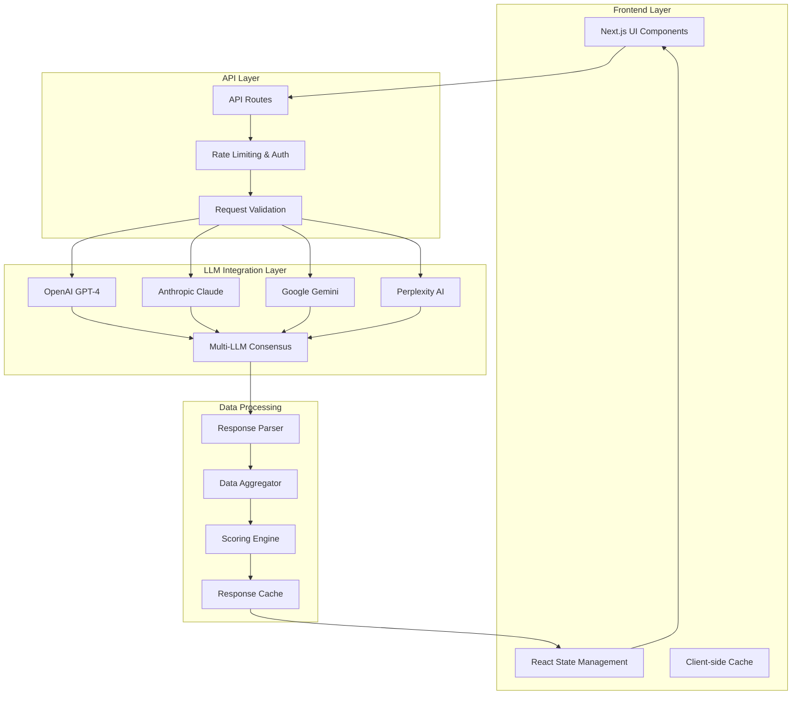
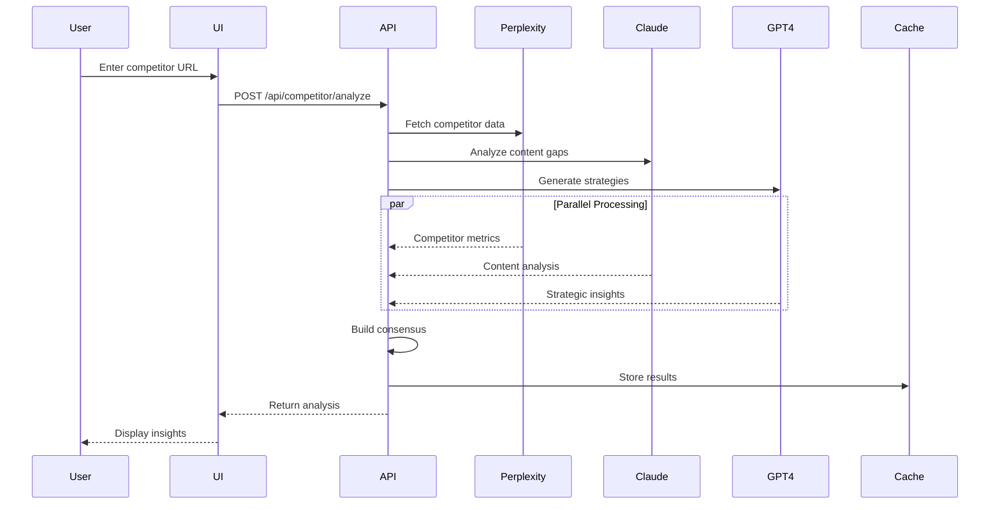
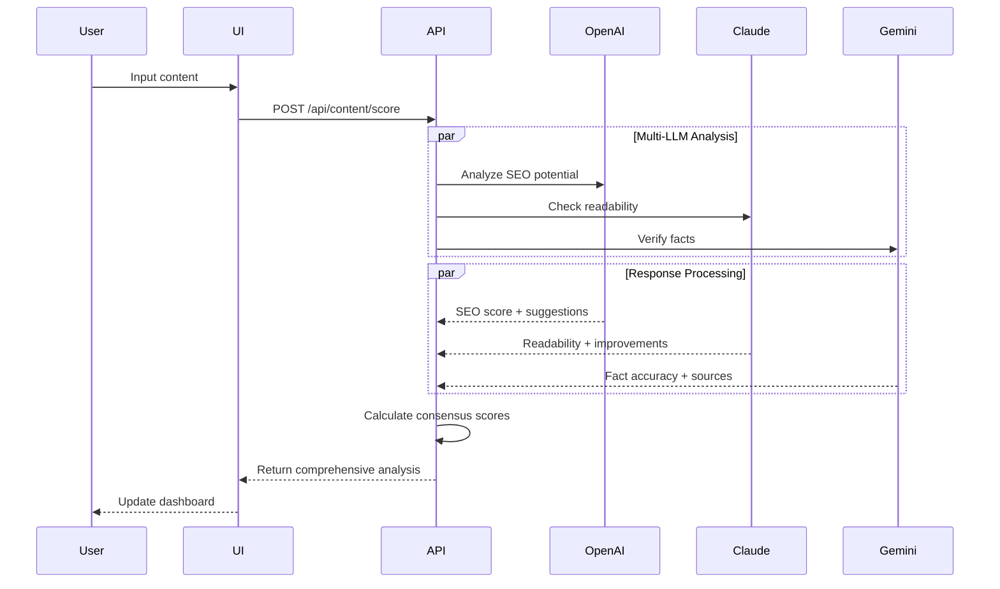

# Design Documentation - Human-First SEO MVP

## System Architecture Blueprint



## API Integration Patterns

### Multi-LLM Consensus System
```typescript
interface LLMResponse {
  provider: 'openai' | 'claude' | 'gemini' | 'perplexity';
  confidence: number;
  data: any;
  timestamp: Date;
}

interface ConsensusResult {
  finalScore: number;
  confidence: number;
  sources: LLMResponse[];
  reasoning: string;
}
```

### Request Flow Architecture
1. **Input Validation**: Sanitize and validate user inputs
2. **Parallel Processing**: Simultaneous API calls to multiple LLMs
3. **Response Aggregation**: Combine and weight responses
4. **Consensus Building**: Calculate final scores with confidence levels
5. **Caching**: Store results for performance optimization
6. **Error Handling**: Graceful degradation and fallback systems

## Component Relationship Mappings

### Core Components Hierarchy
```
App (page.tsx)
├── ScoringDashboard
│   ├── ReadabilityCard
│   ├── OriginalityCard
│   ├── SEOCard
│   └── FactCheckCard
├── WorkflowTabs
│   ├── ResearchTab
│   │   └── CompetitorAnalysis (Enhanced)
│   ├── StructureTab
│   ├── ContentTab
│   ├── OptimizeTab
│   └── ReviewTab
└── ProgressTracker
```

### New Components to Implement
```
/components/
├── api/
│   ├── LLMClient.tsx
│   ├── ConsensusEngine.tsx
│   └── ErrorBoundary.tsx
├── analysis/
│   ├── RealTimeScoring.tsx
│   ├── CompetitorIntelligence.tsx
│   └── KeywordResearch.tsx
└── optimization/
    ├── ContentSuggestions.tsx
    ├── SEORecommendations.tsx
    └── FactChecker.tsx
```

## Data Flow Visualizations

### Competitor Analysis Flow


### Content Scoring Flow


## Required Technologies and Libraries

### Core Dependencies
```json
{
  "dependencies": {
    "openai": "^4.0.0",
    "@anthropic-ai/sdk": "^0.24.0",
    "@google/generative-ai": "^0.15.0",
    "axios": "^1.6.0",
    "node-cache": "^5.1.2",
    "zod": "^3.22.0",
    "rate-limiter-flexible": "^5.0.0"
  }
}
```

### Environment Variables Structure
```env
# OpenAI Configuration
OPENAI_API_KEY=sk-...
OPENAI_MODEL=gpt-4-turbo-preview

# Anthropic Configuration
ANTHROPIC_API_KEY=sk-ant-...
ANTHROPIC_MODEL=claude-3-5-sonnet-20241022

# Google AI Configuration
GOOGLE_AI_API_KEY=AI...
GOOGLE_AI_MODEL=gemini-1.5-pro

# Perplexity Configuration
PERPLEXITY_API_KEY=pplx-...
PERPLEXITY_MODEL=llama-3.1-sonar-large-128k-online

# Application Configuration
NODE_ENV=development
NEXT_PUBLIC_APP_URL=http://localhost:3000
API_RATE_LIMIT=100
CACHE_TTL=3600
```

## Development Milestones with Estimated Timeframes

### Phase 1: Foundation (5-7 Days)
- **Day 1-2**: API client setup and configuration
- **Day 3-4**: Basic API routes and middleware
- **Day 5-6**: Error handling and rate limiting
- **Day 7**: Testing and validation

### Phase 2: Core Functionality (10-12 Days)
- **Day 8-10**: Competitor analysis replacement
- **Day 11-13**: SEO scoring engine overhaul
- **Day 14-16**: Content analysis pipeline
- **Day 17-19**: Multi-LLM consensus system

### Phase 3: Advanced Features (8-10 Days)
- **Day 20-22**: Real-time intelligence features
- **Day 23-25**: Performance optimization
- **Day 26-27**: UI/UX enhancements

### Phase 4: Production (5-7 Days)
- **Day 28-30**: Production deployment
- **Day 31-32**: Monitoring and analytics
- **Day 33-34**: Final testing and optimization

## Dependency Chains and Critical Path Analysis

### Critical Path Dependencies
1. **API Infrastructure** → All other features
2. **Multi-LLM Integration** → Consensus system → Scoring accuracy
3. **Caching System** → Performance → User experience
4. **Error Handling** → Reliability → Production readiness

### Parallel Development Opportunities
- UI components can be enhanced while API integration progresses
- Documentation and testing can run parallel to feature development
- Performance optimization can begin once core features are stable

## Design Decisions and Rationales

### Multi-LLM Approach Rationale
- **Accuracy**: Consensus reduces individual model biases
- **Reliability**: Fallback options if one provider fails
- **Specialization**: Each LLM optimized for specific tasks
- **Cost Optimization**: Use cheaper models for simpler tasks

### Caching Strategy Rationale
- **Performance**: Reduce API call latency and costs
- **User Experience**: Faster response times
- **Rate Limiting**: Stay within API provider limits
- **Reliability**: Serve cached data during API outages

### Component Architecture Rationale
- **Modularity**: Easy to test and maintain individual components
- **Reusability**: Components can be used across different features
- **Scalability**: Easy to add new analysis types
- **Performance**: Lazy loading and code splitting opportunities

## Security and Privacy Considerations

### Data Protection
- **API Key Security**: Environment variables, never client-side
- **User Data**: No persistent storage of sensitive content
- **Rate Limiting**: Prevent abuse and ensure fair usage
- **Input Sanitization**: Prevent injection attacks

### Privacy Measures
- **Content Processing**: Temporary processing only, no storage
- **Analytics**: Aggregate metrics only, no personal data
- **Third-party APIs**: Review privacy policies of all providers
- **GDPR Compliance**: Right to deletion, data minimization

---

*Last Updated: 2025-05-29*
*Next Review: After each major milestone completion*
